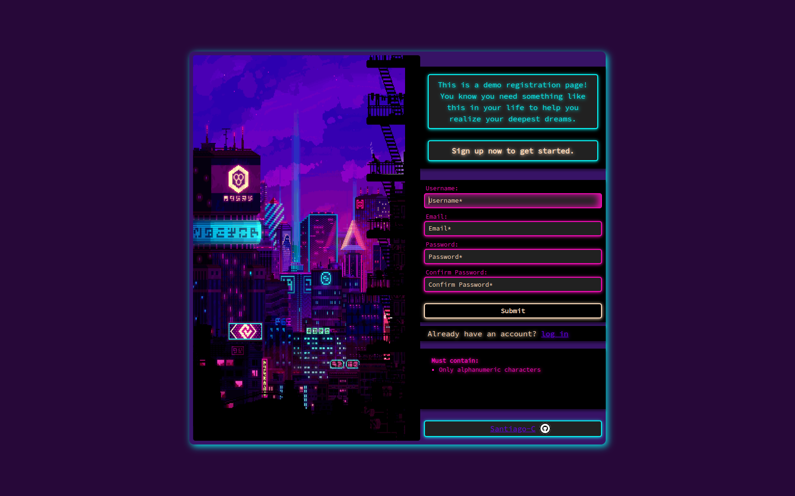

 # Sign-up form
A styled form webpage inspired by old web browsers games.
> Live demo [_here_](https://santyru-c.github.io/Sign-up_form/).

## General Information
The idea behind making this project was to incorporate all the new concepts learned while following all The Odin Project Intermediate HTML and CSS lessons up to form pages. Namely the concepts that are applied in this project are:
- Use of transitions.
- Use of CSS Transform.
- Use of pseudo-classes and pseudo-elements.
- CSS custom properties (variables).
- Custom text fonts and use of @font-face.
- Proper form design and input validation.
- CSS normalization and browser compatibility.

In addition, because it was not necessary to style the webpage exactly as the design file given by TOP. I opted to do my own design, therefore it was required to learn the basics color theory.

## Technologies Used
- 
- 
- 
- I made use of [Adobe Color](https://color.adobe.com/create/image) to extract the main image color scheme.
## Screenshots

## Project Status
Project is: _complete_

## Room for Improvement
The project still has room for a lot of improvement. This should be worked on on future instances. Feedback would be really appreciated.

## Acknowledgements
- This project was inspired by [this other sign-up page](https://rico-game.netlify.app/).
- The original idea for this project was taken from [this lesson](https://www.theodinproject.com/lessons/node-path-intermediate-html-and-css-sign-up-form).

## Contact
Created by [Santyru-C](https://github.com/Santyru-C) - feel free to contact me!

